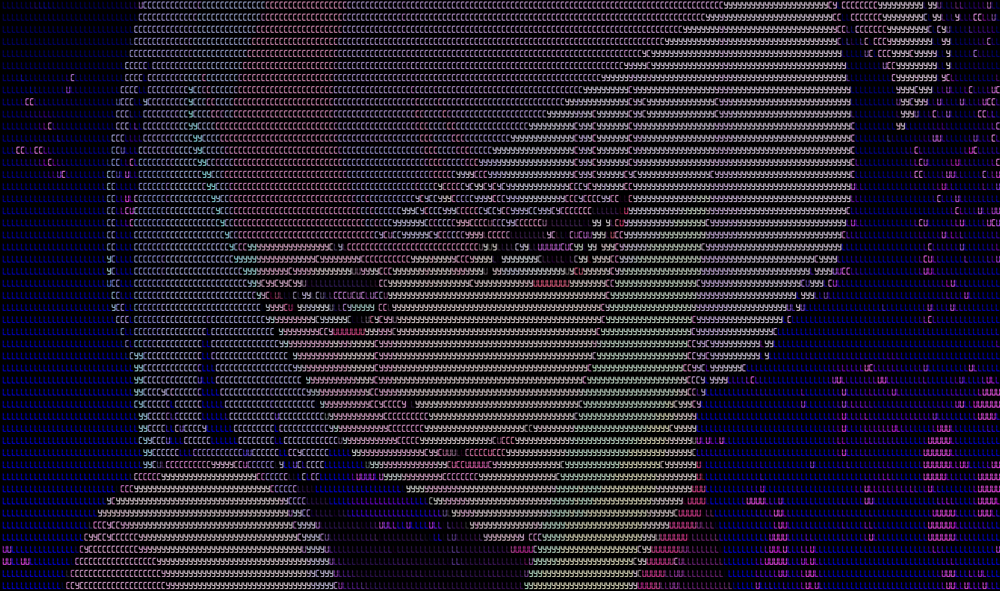
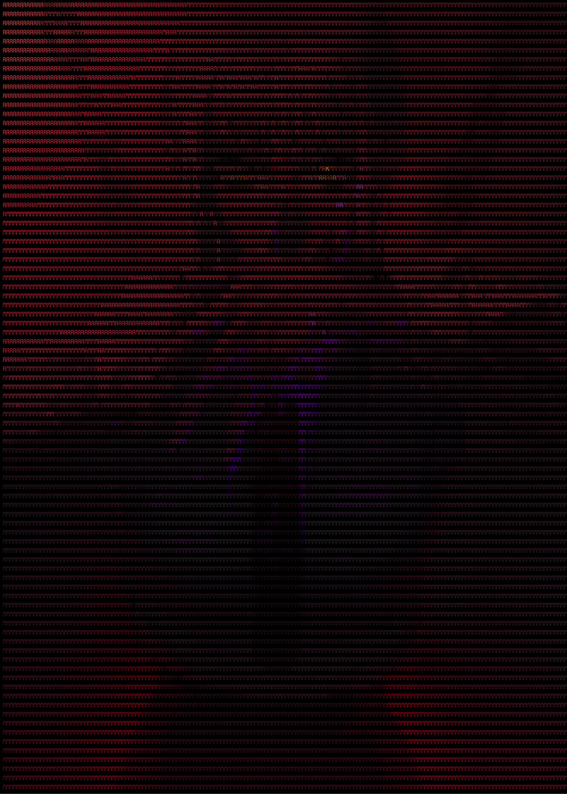
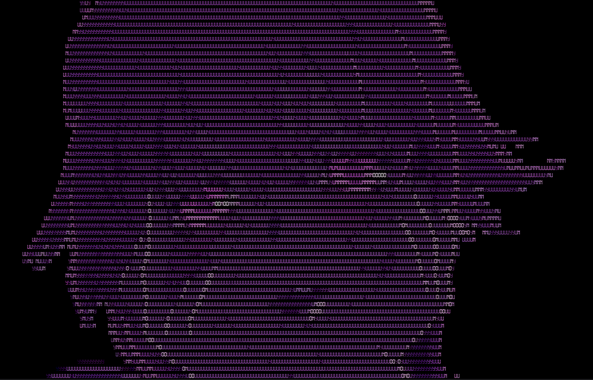

<h3>
C++ Ascii Interpretation of the Image with GUI using ImGui
</h3>

<h4>Build</h4>
  - cmake . -B <build_dir_path>
  - or enter build dir and cmake ..

Cmake works only for linux at this time since some dependencies fails to connect on mingw environment in linux.

<h4>Dependencies</h4>

- [ImGui](https://github.com/ocornut/imgui) included
- [stb](https://github.com/nothings/stb) included
- glfw3
- xorg

<h4>Fonts</h4>

- [Technology](https://www.1001fonts.com/technology-font.html) - Vladimir Nikolic
- [OpenSans](https://fonts.google.com/specimen/Open+Sans) - Steve Matteson

<h4>
Convert your waifu.image to cool & colourful ascii interpretation!
</h4>

Supports ascii resolution resizing, aspect ratio adjustment, and gamma correction.

Depending on the font used, it may have jagged edges or appear misaligned when displayed at different font sizes.

<h4>Sample Outputs</h4>

Based on artwork: "Cyberpunk: Edgerunners" Original Lucy Character Design
  

Based on artwork done by Whoami https://x.com/sok_0000
  

Based on artwork: "Future Diary" Original Anime Art Cutout
  

